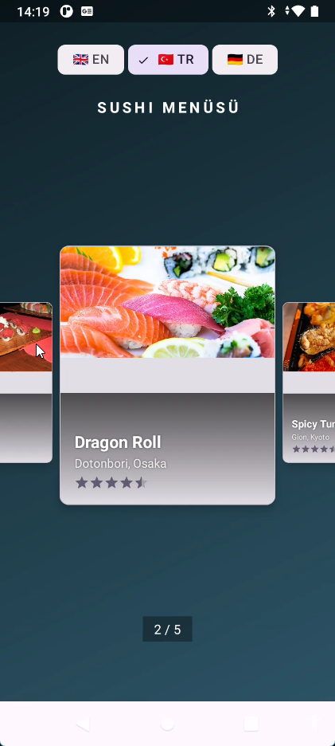
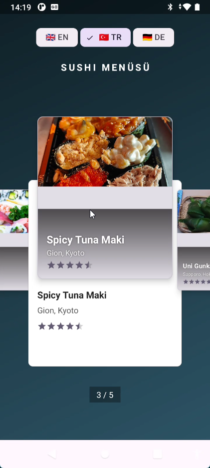
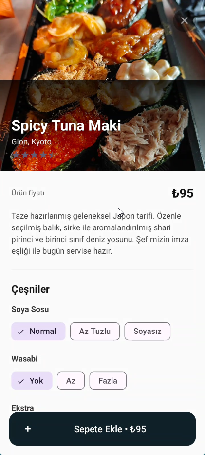
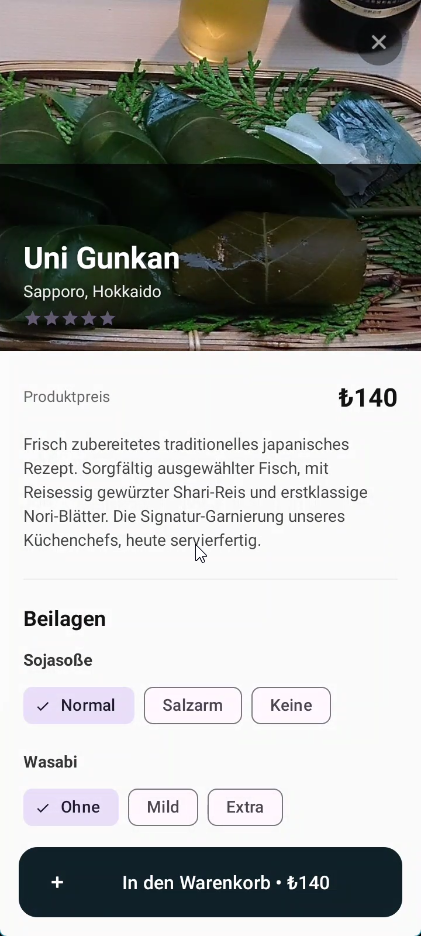

# KarSu Transition Pager

A modern Kotlin + XML Android project that ships a reusable parallax-pager
library module and a full sushi-ordering demo built on top of it.

- 100% Kotlin (no Compose — idiomatic Views + XML)
- `ViewPager2` with a custom parallax `PageTransformer`
- `DragLayout` — drag the card up to reveal a secondary panel, tap to open details
- Drop-in **`TransitionPagerView`** custom view: feed it a `List<TransitionItem>`, done
- Material 3, Coil 2.7 for image loading, ViewBinding, Version Catalog
- Per-app localisation (EN / TR / DE) with a flag chip switcher
- AGP 9 built-in Kotlin, Gradle 8.13, Java 21, compileSdk 36

---

## Demo

<video
  src="https://github.com/kaplanerkan/karsu-transitionpager/raw/main/screenshots/demo.mp4"
  controls
  muted
  loop
  playsinline
  width="320">
  Your browser does not render embedded videos.
  <a href="https://github.com/kaplanerkan/karsu-transitionpager/raw/main/screenshots/demo.mp4">Download demo.mp4</a>
</video>

## Screenshots

| Pager (collapsed) | Pager (drag expanded) | Order screen (TR) | Order screen (DE) |
|:---:|:---:|:---:|:---:|
|  |  |  |  |

---

## Project layout

```
KarSu-ViewpagerTransition/
├── transitionpager/           ← reusable Android library (AAR)
│   └── com.karsu.transitionpager
│       ├── TransitionPagerView     ← public custom view
│       ├── TransitionItem          ← public data class
│       ├── CustPageTransformer     ← parallax for ViewPager2
│       ├── DragLayout              ← drag-to-reveal FrameLayout
│       ├── AspectRatioCardView     ← width-locked MaterialCardView
│       └── TransitionPageAdapter   ← internal RecyclerView adapter
└── app/                       ← demo: sushi ordering screen
    └── com.karsu.viewpagertransition
        ├── KarSuApp             (installs Coil with a Wikimedia-friendly UA)
        ├── MainActivity         (hosts TransitionPagerView + language chips)
        └── DetailActivity       (full-screen order screen)
```

The library module has **zero Compose / Fragment dependencies** — pages are
rendered by a plain `RecyclerView.Adapter` driven by `ViewPager2`.

---

## Library usage

Add the `:transitionpager` module to your project, then drop the view into any
layout:

```xml
<com.karsu.transitionpager.TransitionPagerView
    android:id="@+id/transition_pager"
    android:layout_width="match_parent"
    android:layout_height="match_parent" />
```

Feed it items and react to clicks:

```kotlin
val items = listOf(
    TransitionItem(
        image    = "https://example.com/sushi1.jpg", // String | Uri | @DrawableRes Int
        title    = "Salmon Nigiri",
        subtitle = "Tsukiji, Tokyo",
        rating   = 4.9f,
    ),
    TransitionItem(
        image    = R.drawable.dragon_roll,
        title    = "Dragon Roll",
        subtitle = "Dotonbori, Osaka",
        rating   = 4.7f,
    ),
)

binding.transitionPager.setItems(items)

binding.transitionPager.onItemClick = { item, position, shared ->
    // `shared.image` is the currently visible ImageView — use it for
    // a shared-element Activity transition:
    shared.image.transitionName = "detail_image"
    val options = ActivityOptionsCompat.makeSceneTransitionAnimation(
        this,
        Pair(shared.image, "detail_image"),
    )
    startActivity(Intent(this, DetailActivity::class.java), options.toBundle())
}
```

`TransitionItem.image` is typed `Any` so you can pass any source that Coil
understands — a URL string, `Uri`, `@DrawableRes Int`, `File`, etc.

---

## How the demo works

1. **`MainActivity`** builds a list of `Sushi(TransitionItem, price)` and
   hands the `TransitionItem`s to `TransitionPagerView`. The current per-app
   locale is used to pre-check one of the flag chips
   (`🇬🇧 EN` / `🇹🇷 TR` / `🇩🇪 DE`).
2. Clicking a chip calls
   `AppCompatDelegate.setApplicationLocales(LocaleListCompat.forLanguageTags(tag))`,
   which triggers an automatic activity recreate with the new strings.
3. Swiping the pager applies the parallax transformer; the currently
   centred card can be dragged up (via `DragLayout`) to reveal the secondary
   info panel or tapped to open the detail screen.
4. **`DetailActivity`** launches **full-screen** (system bars hidden via
   `WindowInsetsControllerCompat`) and shows an order form with:
   - Garnish selection: Soy Sauce / Wasabi (single-choice `ChipGroup`)
   - Extras multi-select (Ginger +₺5, Spicy Mayo +₺8, Tempura +₺10)
   - Quantity stepper
   - Sticky *Add to Cart* button that reflects the live total
5. Pressing *Add to Cart* shows a `Snackbar` confirmation with the total.

### Images (Wikimedia Commons)

The demo pulls five real sushi photos from
[Wikimedia Commons — Category:Sushi](https://commons.wikimedia.org/wiki/Category:Sushi).
Wikimedia enforces a
[User-Agent policy](https://meta.wikimedia.org/wiki/User-Agent_policy) and
returns `403` to OkHttp's default UA, so `KarSuApp` installs a global Coil
`ImageLoader` backed by an `OkHttpClient` with a spec-compliant UA
(product + contact URL).

### Localisation

| Locale | Resources              | Flag chip |
|:------:|:-----------------------|:---------:|
| EN     | `values/strings.xml`   | 🇬🇧 EN   |
| TR     | `values-tr/strings.xml`| 🇹🇷 TR   |
| DE     | `values-de/strings.xml`| 🇩🇪 DE   |

`res/xml/locales_config.xml` exposes the languages to the Android 13+ system
settings, and `AppLocalesMetadataHolderService` with `autoStoreLocales=true`
lets AppCompat persist the choice on pre-T devices.

---

## Requirements

| Tool | Version |
|---|---|
| Android Gradle Plugin | **9.1.0** |
| Gradle | **8.13** |
| Kotlin | bundled with AGP built-in Kotlin |
| JDK | **21** |
| `compileSdk` / `targetSdk` | **36** |
| `minSdk` | **24** |

Key dependencies (see `gradle/libs.versions.toml`):

- `androidx.viewpager2:viewpager2`
- `androidx.customview:customview`
- `androidx.appcompat:appcompat`
- `com.google.android.material:material`
- `io.coil-kt:coil`

---

## Build & run

```bash
git clone https://github.com/kaplanerkan/karsu-transitionpager.git
cd karsu-transitionpager
./gradlew :app:assembleDebug
```

Or open the project in Android Studio (Koala or newer recommended) and
press **Run ▶ `app`**.

Network permission is declared in the manifest because the demo fetches its
images from Wikimedia at runtime. If you want to run fully offline, replace
the URLs in `MainActivity.setupPager()` with `@DrawableRes` resource IDs —
`TransitionItem.image` accepts either.

---

## Credits

- Sushi photographs: Wikimedia Commons contributors (CC BY-SA), loaded
  through the
  [Wikimedia Commons Category:Sushi](https://commons.wikimedia.org/wiki/Category:Sushi)
  API.
- Image loading: [Coil](https://github.com/coil-kt/coil)

---

## License

```
Copyright 2026 kaplanerkan

Licensed under the Apache License, Version 2.0 (the "License");
you may not use this file except in compliance with the License.
You may obtain a copy of the License at

    http://www.apache.org/licenses/LICENSE-2.0

Unless required by applicable law or agreed to in writing, software
distributed under the License is distributed on an "AS IS" BASIS,
WITHOUT WARRANTIES OR CONDITIONS OF ANY KIND, either express or implied.
See the License for the specific language governing permissions and
limitations under the License.
```

See the full license text in [`LICENSE`](LICENSE).

**TL;DR** — Apache 2.0 is permissive: you can use, modify and redistribute
this code (including inside closed-source commercial products) as long as
you preserve the copyright notice and don't misuse the project's name or
trademarks. There is no obligation to open-source your own app.
